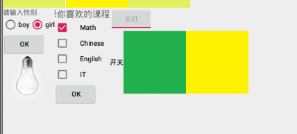

# 开关按钮ToggleButton和开关Switch

### 1.ToggleButton(开关按钮)

- **android:disabledAlpha**：设置按钮在禁用时的透明度
- **android:textOff：**按钮没有被选中时显示的文字
- **android:textOn：**按钮被选中时显示的文字 

### 2.Switch(开关)

- **android:showText：**设置on/off的时候是否显示文字,boolean
- **android:splitTrack：**是否设置一个间隙，让滑块与底部图片分隔,boolean
- **android:switchMinWidth：**设置开关的最小宽度
- **android:switchPadding：**设置滑块内文字的间隔
- **android:switchTextAppearance：**设置开关的文字外观，暂时没发现有什么用...
- **android:textOff：**按钮没有被选中时显示的文字
- **android:textOn：**按钮被选中时显示的文字
- **android:textStyle：**文字风格，粗体，斜体写划线那些
- **android:track：**底部的图片
- **android:thumb：**滑块的图片
- **android:typeface：**设置字体，默认支持这三种:sans, serif, monospace;除此以外还可以使用 其他字体文件(***.ttf**)，首先要将字体文件保存在assets/fonts/目录下，不过需要在Java代码中设置： **Typeface typeFace =Typeface.createFromAsset(getAssets(),"fonts/HandmadeTypewriter.ttf"); textView.setTypeface(typeFace);**

## 测试案例

- #### 两个开关一个负责灯的开关 另一个负责灯开关的开关



#### 界面绘制

```xml
        <RelativeLayout
            android:id="@+id/Switch"
            android:layout_below="@id/Textview1"
            android:layout_toRightOf="@id/Classes"
            android:layout_width="wrap_content"
            android:layout_height="wrap_content">

            <ToggleButton
                android:id="@+id/ToggleBu"
                android:layout_width="wrap_content"
                android:layout_height="wrap_content"
                android:textOff="开灯"
                android:textOn="关灯"
                android:disabledAlpha="0.5"

                />
            <Switch
                android:id="@+id/SwitchT"
                android:layout_below="@id/ToggleBu"
                android:text="开关"
                android:track="@drawable/a0001"
                android:thumb="@drawable/a0004"
                android:layout_width="wrap_content"
                android:layout_height="wrap_content" />

        </RelativeLayout>
```


#### 后端实现

- 更换ImageView的图片使用`setImageResource`

```java
        ToggleBT1.setOnClickListener(new View.OnClickListener() {
            @SuppressLint("ResourceType")
            @RequiresApi(api = Build.VERSION_CODES.LOLLIPOP)
            @Override
            public void onClick(View view) {
                if(ToggleBT1.isChecked()){
                   Lamp.setImageResource(R.drawable.lamp_on);

                }else
                    Lamp.setImageResource(R.drawable.lamp_off);


            }
        });


        SW1.setOnClickListener(new View.OnClickListener() {
            @Override
            public void onClick(View view) {

                if(SW1.isChecked()){
                    ToggleBT1.setEnabled(true);
                }else
                    ToggleBT1.setEnabled(false);

            }
        });

```

