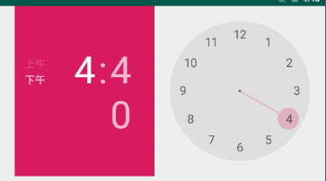

# Date & Time组件

## 1.TextClock(文本时钟)

| Attribute Name           | Related Method                    | Description          |
| ------------------------ | --------------------------------- | -------------------- |
| **android:format12Hour** | **setFormat12Hour(CharSequence)** | **设置12时制的格式** |
| **android:format24Hour** | **setFormat24Hour(CharSequence)** | **设置24时制的格式** |
| **android:timeZone**     | **setTimeZone(String)**           | **设置时区**         |


### Android TextClock时间格式

```xml
android:format12Hour="时间格式"
```

|      格式      |      效果      |
| :------------: | :------------: |
| yyyy年MM月dd日 | 2020年11月17日 |
|   yyyy/MM/dd   |   2020/11/17   |
|   yyyy-MM-dd   |   2020-11-17   |
|      EEEE      |     星期二     |
|      EEE       |      周二      |
|       aa       |      下午      |
|    HH:mm:ss    |    15:53:05    |
|    hh:mm:ss    |    03:53:05    |


## 2.AnalogClock(模拟时钟)


```xml
 android:dial=""
 android:hand_hour=""
 android:hand_minute="" 
```

依次是：表背景，表时针，分时针的图片，我们可以自行定制：

背景也可以用background


## 3.Chronometer(计时器)


### 计时器布局


```xml
    <Chronometer
        android:id="@+id/chronometer"

        android:layout_width="wrap_content"
        android:layout_height="wrap_content"
        android:layout_below="@id/Aclack1"
        android:layout_marginLeft="18dp"
        android:textSize="28dp"
        />
    <LinearLayout

        android:layout_below="@id/chronometer"
        android:layout_width="wrap_content"
        android:layout_height="wrap_content">

        <Button
            android:id="@+id/Ch_Bt1"
            android:layout_width="wrap_content"
            android:layout_height="wrap_content"
            android:text="start"/>


        <Button
            android:id="@+id/Ch_Bt2"
            android:layout_width="wrap_content"
            android:layout_height="wrap_content"
            android:text="stop"/>

        <Button
            android:id="@+id/Ch_Bt3"
            android:layout_width="wrap_content"
            android:layout_height="wrap_content"
            android:text="clear"/>

    </LinearLayout>
```

### 计时实现代码

- 计时的时候会有小bug
- 虽然时间停下了但是下次开始时间没有停下

```java
 private void Timer() {


        Bt1 = findViewById(R.id.Ch_Bt1);
        Bt2 = findViewById(R.id.Ch_Bt2);
        Bt3 = findViewById(R.id.Ch_Bt3);
        Chron1 = findViewById(R.id.chronometer);

        Chron1.setOnChronometerTickListener(this);
        Bt1.setOnClickListener(this);
        Bt2.setOnClickListener(this);
        Bt3.setOnClickListener(this);


    }

    @Override
    public void onClick(View view) {
        switch (view.getId()){
            case R.id.Ch_Bt1:
                Chron1.start();
                break;
            case R.id.Ch_Bt2:
                Chron1.stop();
                break;
            case R.id.Ch_Bt3:
                Chron1.setBase(SystemClock.elapsedRealtime());
                break;

        }


    }

    @Override
    public void onChronometerTick(Chronometer chronometer) {

        String time = Chron1.getText().toString();
        if(time.equals("00:30")){
            Toast.makeText(this, "时间到", Toast.LENGTH_SHORT).show();

        }
    }
}
```

## 4.DatePicker(日期选择器)


**默认效果，效果不错**


### 相关属性

- **用到时再查**

- **android:calendarTextColor** ： 日历列表的文本的颜色
- **android:calendarViewShown**：是否显示日历视图
- **android:datePickerMode**：组件外观，可选值:spinner，calendar 前者效果如下，默认效果是后者 
- **android:dayOfWeekBackground**：顶部星期几的背景颜色
- **android:dayOfWeekTextAppearance**：顶部星期几的文字颜色
- **android:endYear**：去年(内容)比如2010
- **android:firstDayOfWeek**：设置日历列表以星期几开头
- **android:headerBackground**：整个头部的背景颜色
- **android:headerDayOfMonthTextAppearance**：头部日期字体的颜色
- **android:headerMonthTextAppearance**：头部月份的字体颜色
- **android:headerYearTextAppearance**：头部年的字体颜色
- **android:maxDate**：最大日期显示在这个日历视图mm / dd / yyyy格式
- **android:minDate**：最小日期显示在这个日历视图mm / dd / yyyy格式
- **android:spinnersShown**：是否显示spinner
- **android:startYear**：设置第一年(内容)，比如19940年
- **android:yearListItemTextAppearance**：列表的文本出现在列表中。
- **android:yearListSelectorColor**：年列表选择的颜色


**这是spinner的效果**

## 5.CalendarView(日历视图)

界面是这样的


相关属性

- **android:firstDayOfWeek**：设置一个星期的第一天
- **android:maxDate** ：最大的日期显示在这个日历视图mm / dd / yyyy格式
- **android:minDate**：最小的日期显示在这个日历视图mm / dd / yyyy格式
- **android:weekDayTextAppearance**：工作日的文本出现在日历标题缩写

日历有相应的方法去写

但是我这里是一直报错


## 6.TimePicker(时间选择器)



 clock 跑起来是这个样子

**android:timePickerMode***：组件外观，同样可选值为:spinner和clock(默认)* 