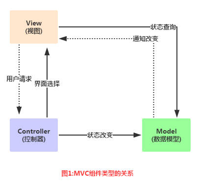
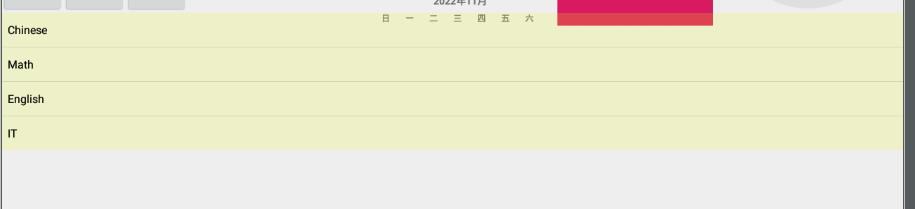

# Adapter

Adapter 

- **翻译** n. 适配器；改编者；接合器；适应者

## 2.4.4 Adapter讲解

### [2.4.4 Adapter基础讲解 | 菜鸟教程 (runoob.com)](https://www.runoob.com/w3cnote/android-tutorial-adapter.html)

## 本节引言

> 从本节开始我们要讲的UI控件都是跟Adapter(适配器)打交道的，了解并学会使用这个Adapter很重要， Adapter是用来帮助填充数据的中间桥梁，简单点说就是：将各种数据以合适的形式显示到view上,提供 给用户看！

------

## 1.MVC模式的简单理解

> 在开始学习Adapter之前我们要来了解下这个MVC模式概念： 举个例子：大型的商业程序通常由多人一同开发完成,比如有人负责操作接口的规划与设计, 有人负责程序代码的编写如果要能够做到程序项目的分工就必须在程序的结构上做适合的安排 ,如果,接口设计与修改都涉及到程序代码的改变的话,那么两者的分工就会造成执行上的困难 良好的程序架构师将整个程序项目划分为如图的三个部分:



**关系图解析：**

> - **Model**：通常可以理解为数据,负责执行程序的核心运算与判断逻辑,,通过view获得用户 输入的数据,然后根据从数据库查询相关的信息,最后进行运算和判断,再将得到的结果交给view来显示
> - **view**:用户的操作接口,说白了就是GUI,应该使用哪种接口组件,组件间的排列位置与顺序都需要设计
> - **Controller**:控制器,作为model与view之间的枢纽,负责控制程序的执行流程以及对象之间的一个互动

而这个Adapter则是中间的这个Controller的部分： **Model**(数据) ---> **Controller**(以什么方式显示到)---> **View**(用户界面) 这就是简单MVC组件的简单理解！

------

## 2.Adapter概念解析

官方文档：[Adapter](http://androiddoc.qiniudn.com/reference/android/widget/Adapter.html)

首先我们来看看他的继承结构图：


上面就是Adapter以及继承结构图了，接着我们介绍一下实际开发中还用到的几个Adapter吧！

> - **BaseAdapter**：抽象类，实际开发中我们会继承这个类并且重写相关方法，用得最多的一个Adapter！
> - **ArrayAdapter**：支持泛型操作，最简单的一个Adapter，只能展现一行文字~
> - **SimpleAdapter**：同样具有良好扩展性的一个Adapter，可以自定义多种效果！
> - **SimpleCursorAdapter**：用于显示简单文本类型的listView，一般在数据库那里会用到，不过有点过时， 不推荐使用！

其实一个BaseAdapter就够玩的了，至于其他的，实际开发中用得不多，后面用到在讲解~


### 实际使用


```java
private ListView List;
    private void Adapter_test() {

        String[] Class = {"Chinese","Math","English","IT"};
        ArrayAdapter<String> adapter = new ArrayAdapter<String>(this,R.layout.support_simple_spinner_dropdown_item,Class);


         List = findViewById(R.id.ListView);
         List.setAdapter(adapter);

    }

```


```xml
<ListView
    android:layout_below="@id/Linear01"
    android:id="@+id/ListView"
    android:layout_width="wrap_content"
    android:layout_height="wrap_content"
    android:background="#2cf0ff0f">
</ListView>
```


