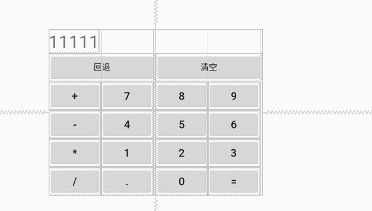

# 安卓布局练习网格布局

- 可以自己设置布局中组件的排列方式
- 可以自定义网格布局有多少行,多少列
- 可以直接设置组件位于某行某列
- 可以设置组件横跨几行或者几列


## 属性设置

- 设置行数 `rowCount`
- 设置列数`columnCount`

- 设置组件所在行 layout_row
- 设置组件所在列 layout_column

- 设置组件横跨几行 `layout_rowSpan`
- 设置组件横跨几列 `layout_columnSpan`




```xml
<?xml version="1.0" encoding="utf-8"?>
<RelativeLayout xmlns:android="http://schemas.android.com/apk/res/android"
    xmlns:app="http://schemas.android.com/apk/res-auto"
    xmlns:tools="http://schemas.android.com/tools"
    android:layout_width="match_parent"
    android:orientation="horizontal"
    android:layout_height="match_parent"
    tools:context=".UT"
    >

    <GridLayout
        android:layout_centerInParent="true"
        android:layout_width="wrap_content"
        android:layout_height="wrap_content"
        android:orientation="horizontal"
        android:rowCount="6"
        android:columnCount="4"
        >


        <TextView
            android:text="11111"
            android:textSize="30dp"
            android:layout_columnSpan="4"
            />
        <Button android:layout_columnSpan="2" android:text="回退" android:layout_width="180dp" />
        <Button android:layout_columnSpan="2" android:text="清空" android:layout_width="180dp"/>
        <Button android:text="+" android:textSize="18dp" />
        <Button android:text="7" android:textSize="18dp"/>
        <Button android:text="8" android:textSize="18dp"/>
        <Button android:text="9" android:textSize="18dp"/>
        <Button android:text="-" android:textSize="18dp"/>
        <Button android:text="4" android:textSize="18dp"/>
        <Button android:text="5" android:textSize="18dp"/>
        <Button android:text="6" android:textSize="18dp"/>
        <Button android:text="*" android:textSize="18dp"/>
        <Button android:text="1" android:textSize="18dp"/>
        <Button android:text="2" android:textSize="18dp"/>
        <Button android:text="3" android:textSize="18dp"/>
        <Button android:text="/" android:textSize="18dp"/>
        <Button android:text="." android:textSize="18dp"/>
        <Button android:text="0" android:textSize="18dp"/>
        <Button android:text="=" android:textSize="18dp"/>


    </GridLayout>


</RelativeLayout>
```

