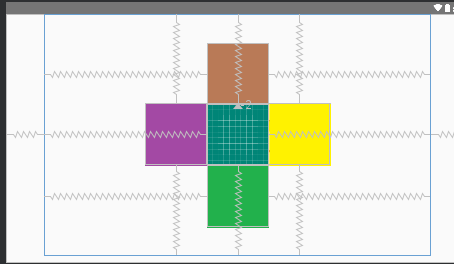
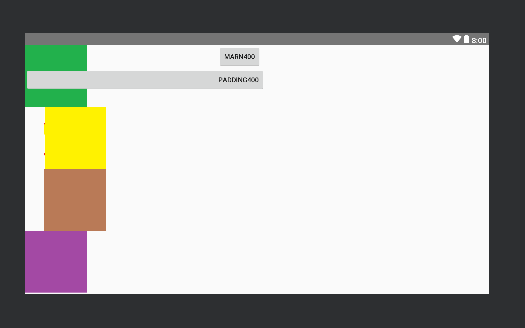

# 相对布局RelativeLayout

## 属性参数

### 基本属性

- `gravity` 设置容器内组件的对齐方式
- `ignoreGravity` 该属性设置为true的组件不受gravity 属性的影响

## 根据容器定位

- `layout_alignParentLeft` 左对齐
- `layout_alignParentRight` 右对齐
- `layout_alignParentTop` 顶部对齐
- `layout_alignParentBottom` 底部对齐
- `layout_centerHorizontal` 水平居中
- `layout_centerVertical` 垂直居中
- `layout_centerInParent`中心位置

### 根据其他组件定位(相对位置)

- `toLeftOf(id) `id元件的左边位置
- `toRightOf(id)` id元件的右边位置
- `above(id)` id元件的上方位置
- `below(id) `id元件的下方位置
- `alignTop(id)`id元件的上边界
- `alignBottom(id)`id元件的下边界
- `alignLeft(id)`id元件的左边界
- `alignRight(id)`id元件的右边界

## 组件位置偏移

- `margin `组件上下左右的偏移量
- `marginLeft `组件左的偏移量
- `marginRight `组件右的偏移量
- `marginTop` 组件上的偏移量
- `marginBottom` 组件下的偏移量

## 组件内部填充偏移

- `padding`组件上下左右填充边距
- `paddingLeft`组件左方填充边距
- `paddingRight`组件右方填充边距
- `paddingTop`组件上方填充边距
- `paddingBottom` 组件下方填充边距


## 梅花布局



## 代码

```xml
<?xml version="1.0" encoding="utf-8"?>
<RelativeLayout xmlns:android="http://schemas.android.com/apk/res/android"
    xmlns:app="http://schemas.android.com/apk/res-auto"
    xmlns:tools="http://schemas.android.com/tools"
    android:layout_width="match_parent"
    android:orientation="horizontal"
    android:layout_height="match_parent"
    tools:context=".UT"
    >
<RelativeLayout
    android:layout_width="800dp"
    android:layout_height="500dp"
    android:layout_centerHorizontal="true"

    >

    <ImageView
        android:id="@+id/m1"
        android:layout_width="128dp"
        android:layout_height="128dp"
        android:layout_centerHorizontal="true"
        android:layout_centerVertical="true"
        android:src="@drawable/ic_launcher_background"
        />
    <ImageView
        android:id="@+id/m2"
        android:layout_width="wrap_content"
        android:layout_height="wrap_content"
        android:layout_centerVertical="true"
        android:layout_toRightOf="@id/m1"
        android:src="@drawable/a0001"

        />

    <ImageView
        android:id="@+id/m3"
        android:layout_width="wrap_content"
        android:layout_height="wrap_content"
        android:layout_above="@id/m2"
        android:layout_centerHorizontal="true"
        android:layout_marginBottom="-3dp"

        android:src="@drawable/a0002" />

    <ImageView
        android:id="@+id/m4"
        android:layout_width="wrap_content"
        android:layout_height="wrap_content"
        android:layout_toLeftOf="@id/m3"
        android:layout_centerVertical="true"
        android:src="@drawable/a0003"
        />
    <ImageView
        android:id="@+id/m5"
        android:layout_width="wrap_content"
        android:layout_height="wrap_content"
        android:layout_centerHorizontal="true"
        android:src="@drawable/a0004"
        android:layout_below="@id/m1"
        />


</RelativeLayout>


</RelativeLayout>
```


## 设置边距margin与padding的区别

**margin(偏移)**

**padding(填充)**




```xml
<?xml version="1.0" encoding="utf-8"?>
<RelativeLayout xmlns:android="http://schemas.android.com/apk/res/android"
    xmlns:app="http://schemas.android.com/apk/res-auto"
    xmlns:tools="http://schemas.android.com/tools"
    android:layout_width="match_parent"
    android:orientation="horizontal"
    android:layout_height="match_parent"
    tools:context=".UT"
    >
<RelativeLayout
    android:layout_width="match_parent"
    android:layout_height="match_parent"
    android:layout_centerHorizontal="true"

    >

   <ImageView
        android:id="@+id/m1"
        android:layout_width="128dp"
        android:layout_height="128dp"
        android:src="@drawable/ic_launcher_background"

        />
    <ImageView
        android:id="@+id/m2"
        android:layout_width="wrap_content"
        android:layout_height="wrap_content"

        android:layout_below="@id/m1"
        android:src="@drawable/a0001"
        android:paddingLeft="40dp"
        />

    <ImageView
        android:id="@+id/m3"
        android:layout_width="wrap_content"
        android:layout_height="wrap_content"
        android:layout_below="@id/m2"
        android:layout_marginLeft="40dp"
        android:src="@drawable/a0002" />

    <ImageView
        android:id="@+id/m4"
        android:layout_width="wrap_content"
        android:layout_height="wrap_content"
        android:layout_below="@id/m3"
        android:src="@drawable/a0003"
        />
    <ImageView
        android:id="@+id/m5"
        android:layout_width="wrap_content"
        android:layout_height="wrap_content"
        android:src="@drawable/a0004"


        />
    <Button
        android:id="@+id/b1"
        android:layout_width="wrap_content"
        android:layout_height="wrap_content"
        android:text="marn400"
        android:layout_marginLeft="400dp"
        />

    <Button
        android:id="@+id/b2"
        android:layout_width="wrap_content"
        android:layout_height="wrap_content"
        android:text="padding400"
        android:layout_below="@id/b1"
        android:paddingLeft="400dp"
        />


</RelativeLayout>


</RelativeLayout>
```

