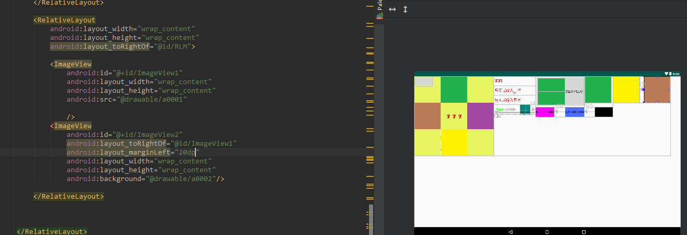

# ImageView(图像视图)

## 1.src属性和background属性的区别：

正常看来是没有什么区别

当把高度设置为200dp时

.assets/image-20221026111649820.png)

.assets/image-20221026111632627.png

在API文档中我们发现ImageView有两个可以设置图片的属性，分别是：src和background

**常识：**

① background通常指的都是**背景**,而src指的是**内容**!!

② 当使用**src**填入图片时,是按照图片大小**直接填充**,并**不会进行拉伸**

而使用background填入图片,则是会根据ImageView给定的宽度来进行**拉伸**

## 图像设置透明度

使用`setAlpha` 传小于1的浮点型数 只有src可用

或者**找一张透明的png图片然后更改透明度 **

总结：放图片时尽量先计算好大小和调整好透明度在放相应位置图片