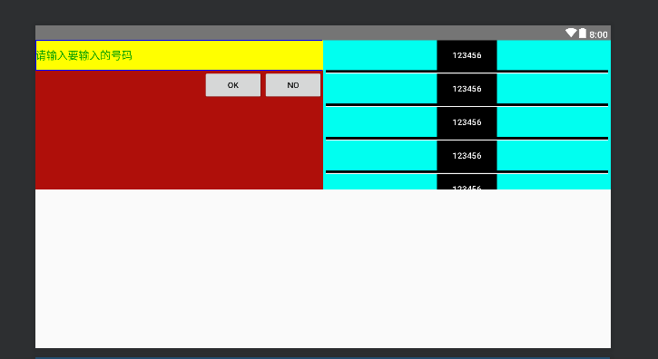

# 线性布局|LinearLayout

## 线性布局常用代码

- `orientation` 设置布局下组件的排列方式
  - 参数： horizontal(水平)  vertical (垂直)
- gravity 控制布局子元件的对齐方式
  - 参数： left | right | ....
- `layout_gravity` 控制组件在父级的对齐方式
- `layout_widht` 布局的宽度
  - 参数：一般不直接写数字
  - 用`match_parent`填满父级容器
  - `warp_content` 组件实际大小
- `layout_height` 布局高度 参数同上
- id为组件设置一个资源id可以通过findViewByid(id)找到该组件
- `background` 为组件设置图片或者直接填充颜色

- weight -等比划分


- divider分割线  
  - 设置分割线的图片 divider
  - 设置分割线的位置 showdividers
  - 设置分割线的Padding内边距


### 页面展示



### 代码展示

```xml
<?xml version="1.0" encoding="utf-8"?>
<LinearLayout xmlns:android="http://schemas.android.com/apk/res/android"
    xmlns:app="http://schemas.android.com/apk/res-auto"
    xmlns:tools="http://schemas.android.com/tools"
    android:layout_width="match_parent"
    android:orientation="horizontal"
    android:layout_height="match_parent"
    tools:context=".UT"
    android:dividerPadding="10dp">

    <LinearLayout
        android:layout_width="0dp"
        android:layout_height="250dp"
        android:layout_weight="2"
        android:background="#AF0F0A"
        android:orientation="vertical"
        >

<EditText
    android:layout_width="match_parent"
    android:layout_height="50dp"
    android:background="#ffff00"
    android:text="请输入要输入的号码"
    android:textColor="#0AA000"
    />

        <LinearLayout
            android:layout_width="match_parent"
            android:layout_height="match_parent"
            android:gravity="right">

            <Button
                android:layout_width="100dp"
                android:layout_height="50dp"
                android:text="OK" />

            <Button
                android:layout_width="100dp"
                android:layout_height="50dp"
                android:text="NO" />


        </LinearLayout>


    </LinearLayout>

    <LinearLayout
        android:layout_width="0dp"
        android:layout_weight="2"
        android:layout_height="250dp"
        android:background="#00fff0"
        android:orientation="vertical"
        android:gravity="center_horizontal"
        android:divider="@drawable/line"
        android:showDividers="middle"
        android:dividerPadding="5dp"

        >

        <Button
            android:layout_width="100dp"
            android:layout_height="50dp"
            android:background="#000000"
            android:text="123456"
            android:textColor="#ffff" />


        <Button
            android:layout_width="100dp"
            android:layout_height="50dp"
            android:background="#000000"
            android:text="123456"
            android:textColor="#ffff" />


        <Button
            android:layout_width="100dp"
            android:layout_height="50dp"
            android:background="#000000"
            android:text="123456"
            android:textColor="#ffff" />
        <Button
            android:layout_width="100dp"
            android:layout_height="50dp"
            android:background="#000000"
            android:text="123456"
            android:textColor="#ffff" />
        <Button
            android:layout_width="100dp"
            android:layout_height="50dp"
            android:background="#000000"
            android:text="123456"
            android:textColor="#ffff" />


    </LinearLayout>


</LinearLayout>
```

