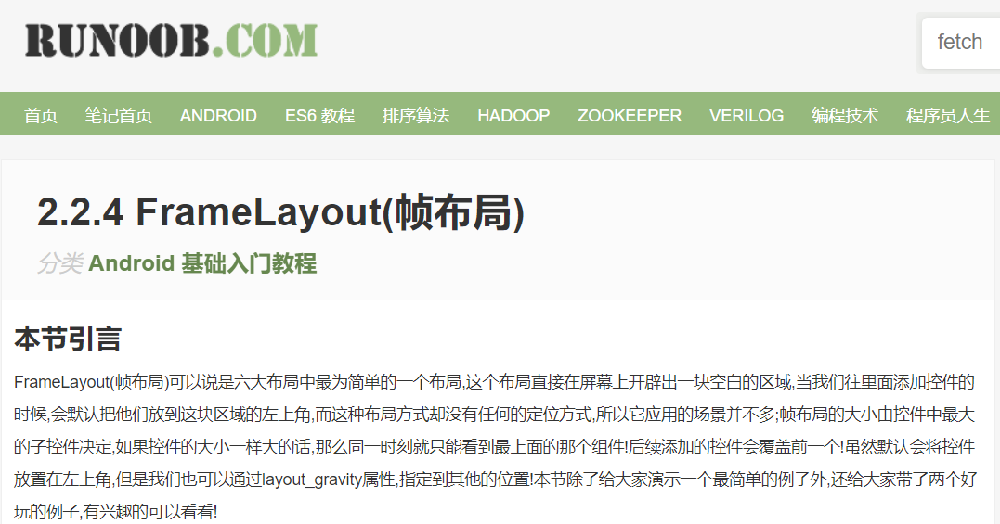
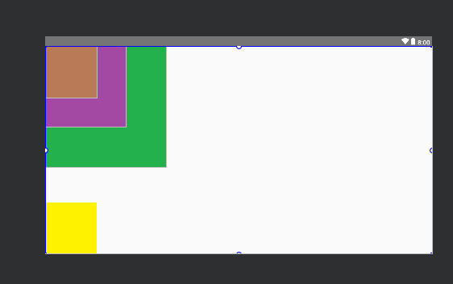

# 安卓布局练习帧布局

直接拿过来




`FrameLayout`的属性很少就两个,但是在说之前我们先介绍一个东西:

前景图像:永远处于帧布局最上面,直接面对用户的图像,就是不会被覆盖的图片。

两个属性:

- `**android:foreground`:\***设置改帧布局容器的前景图像
- **`android:foregroundGravity`:**设置前景图像显示的位置


图层位置越靠下位置在上



## 代码

```xml
<?xml version="1.0" encoding="utf-8"?>
<RelativeLayout xmlns:android="http://schemas.android.com/apk/res/android"
    xmlns:app="http://schemas.android.com/apk/res-auto"
    xmlns:tools="http://schemas.android.com/tools"
    android:layout_width="match_parent"
    android:orientation="horizontal"
    android:layout_height="match_parent"
    tools:context=".UT"
              
    >

    <FrameLayout
        android:layout_width="match_parent"
        android:layout_height="match_parent"
        android:foreground="@drawable/a0001"
        android:foregroundGravity="left|bottom"
        >
  <!--位置设置 -->

        <ImageView
            android:layout_width="300dp"
            android:layout_height="300dp"
            android:src="@drawable/a0004"
            />
        <ImageView
            android:layout_width="200dp"
            android:layout_height="200dp"
            android:src="@drawable/a0003"
            />
        <ImageView
            android:layout_width="wrap_content"
            android:layout_height="wrap_content"
            android:src="@drawable/a0002"
            />


    </FrameLayout>

</RelativeLayout>
```

