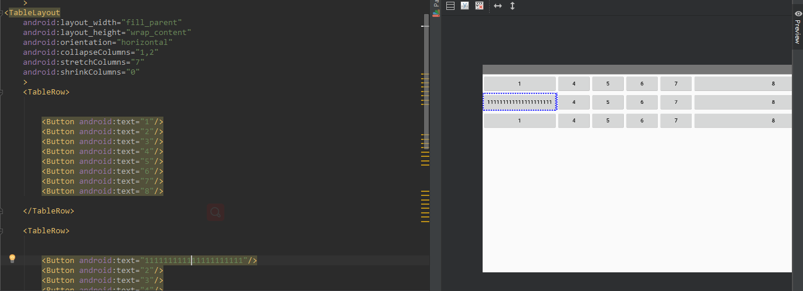

# 安卓布局练习表格布局TableLayout

### `collapseColumns`(隐藏列)

隐藏该列

### `stretchColumns`(拉伸列)

让该列填满这一行所有的剩余空间

### `shrinkColumns`(收缩列)


`TableLayout`布局表格写在`TableRow`里面

有多少`TableRow`就有多少行

## 布局图片及代码图片



## 代码

```xml
<?xml version="1.0" encoding="utf-8"?>
<RelativeLayout xmlns:android="http://schemas.android.com/apk/res/android"
    xmlns:app="http://schemas.android.com/apk/res-auto"
    xmlns:tools="http://schemas.android.com/tools"
    android:layout_width="match_parent"
    android:orientation="horizontal"
    android:layout_height="match_parent"
    tools:context=".UT"
    >
<TableLayout
    android:layout_width="fill_parent"
    android:layout_height="wrap_content"
    android:orientation="horizontal"
    android:collapseColumns="1,2"
    android:stretchColumns="7"
    android:shrinkColumns="0"
    >
    <TableRow>


        <Button android:text="1"/>
        <Button android:text="2"/>
        <Button android:text="3"/>
        <Button android:text="4"/>
        <Button android:text="5"/>
        <Button android:text="6"/>
        <Button android:text="7"/>
        <Button android:text="8"/>

    </TableRow>

    <TableRow>


        <Button android:text="111111111111111111111"/>
        <Button android:text="2"/>
        <Button android:text="3"/>
        <Button android:text="4"/>
        <Button android:text="5"/>
        <Button android:text="6"/>
        <Button android:text="7"/>
        <Button android:text="8"/>

    </TableRow>
    <TableRow>


        <Button android:text="1"/>
        <Button android:text="2"/>
        <Button android:text="3"/>
        <Button android:text="4"/>
        <Button android:text="5"/>
        <Button android:text="6"/>
        <Button android:text="7"/>
        <Button android:text="8"/>

    </TableRow>


</TableLayout>


</RelativeLayout>
```

